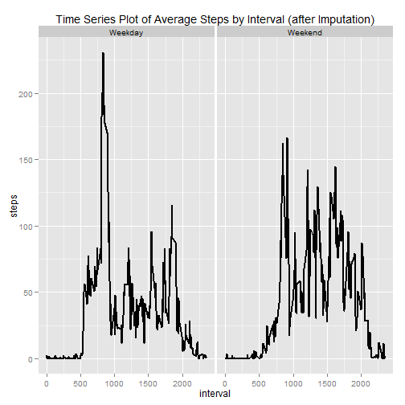

# Reproducible Research: Peer Assessment 1

## Loading and preprocessing the data


```r
unzip(zipfile = "activity.zip")
data <- read.csv("activity.csv")
data$date <- as.Date(data$date)
```

## What is mean total number of steps taken per day?

### Plot histogram on total number of steps taken per day


```r
library(ggplot2)
TotSteps <- aggregate(x = data$steps , by = list(data$date), FUN = sum ,na.rm=TRUE)
names(TotSteps) <- c("date","steps")
histplot <- ggplot(TotSteps,aes(x = steps)) +
            ggtitle("Total no. of steps taken per day") +
            xlab("Steps") +
            geom_histogram(binwidth = 2000, fill='light green')
histplot
```

 

### Compute MEAN on number of steps taken per day


```r
mean(TotSteps$steps , na.rm = TRUE)
```

```
## [1] 9354.23
```

### Compute MEDIAN on number of steps taken per day


```r
median(TotSteps$steps , na.rm = TRUE)
```

```
## [1] 10395
```

## What is the average daily activity pattern?

### Plot time series of 5-minute interval and the average number of steps taken, across all days.


```r
avgsteps  <- aggregate(x = data$steps , by = list(data$interval), FUN = mean ,na.rm=TRUE)
names(avgsteps) <- c("interval","steps")

avgstepsline <- ggplot(avgsteps,aes(interval,steps)) +
                 ggtitle("Time Series Plot of Average Steps Taken") +
                 geom_line(size=1)
avgstepsline  
```

 

### 5-min time interval containing most number of steps


```r
avgsteps[which.max(avgsteps$steps),c("interval")]
```

```
## [1] 835
```

## Impute missing values

### Total number of missing values


```r
nrow(data[is.na(data$steps),])
```

```
## [1] 2304
```

### Impute missing step values with MEAN step values


```r
dataimputed <- merge(x = data, y = avgsteps, by = "interval", all.x = TRUE)
dataimputed[is.na(dataimputed$steps.x),c("steps.x")] <- dataimputed[is.na(dataimputed$steps.x),c("steps.y")]
```

### Cleaning new dataset (imputed dataset)


```r
dataimputed$date <- as.Date(dataimputed$date)
dataimputed$date.x <- NULL
dataimputed$Group.1 <- NULL
dataimputed$steps <- dataimputed$steps.x
dataimputed$steps.x <- NULL
dataimputed$steps.y <- NULL
```

### Plot histogram with imputed dataset


```r
IMPTotSteps <- aggregate(x = dataimputed$steps , by = list(dataimputed$date), FUN = sum ,na.rm=TRUE)
names(IMPTotSteps) <- c("date","steps")
histplot <- ggplot(IMPTotSteps,aes(x = steps)) +
            ggtitle("Total steps taken per day (after imputation)") +
            xlab("Steps") +
            geom_histogram(binwidth = 2000, fill='light green')
histplot 
```

 

### Compute new MEAN number of steps taken per day


```r
mean(IMPTotSteps$steps , na.rm = TRUE)
```

```
## [1] 10766.19
```

### Compute new MEDIAN number of steps taken per day


```r
median(IMPTotSteps$steps , na.rm = TRUE)
```

```
## [1] 10766.19
```

## Are there differences in activity patterns between weekdays and weekends?

### Factor variables indicating a weekday or weekend


```r
dataimputed$weekday <- as.factor(ifelse(weekdays(dataimputed$date) %in% c("Saturday","Sunday"), "Weekend", "Weekday")) 
```

### Plot panel time series of the 5-minute interval and the average number of steps taken, averaged across all days in weekday or all days in weekend.


```r
avgstepsweekday  <- aggregate(x = dataimputed$steps , 
                                                    by = list(dataimputed$interval,dataimputed$weekday), FUN = mean ,na.rm=TRUE)
names(avgstepsweekday) <- c("interval","weekday","steps")

avgstepsline2 <- ggplot(avgstepsweekday,aes(interval,steps)) +
                 ggtitle("Time Series Plot of Average Steps by Interval (after Imputation)") +
                 facet_grid(. ~ weekday) +
                 geom_line(size = 1)
avgstepsline2  
```

 
